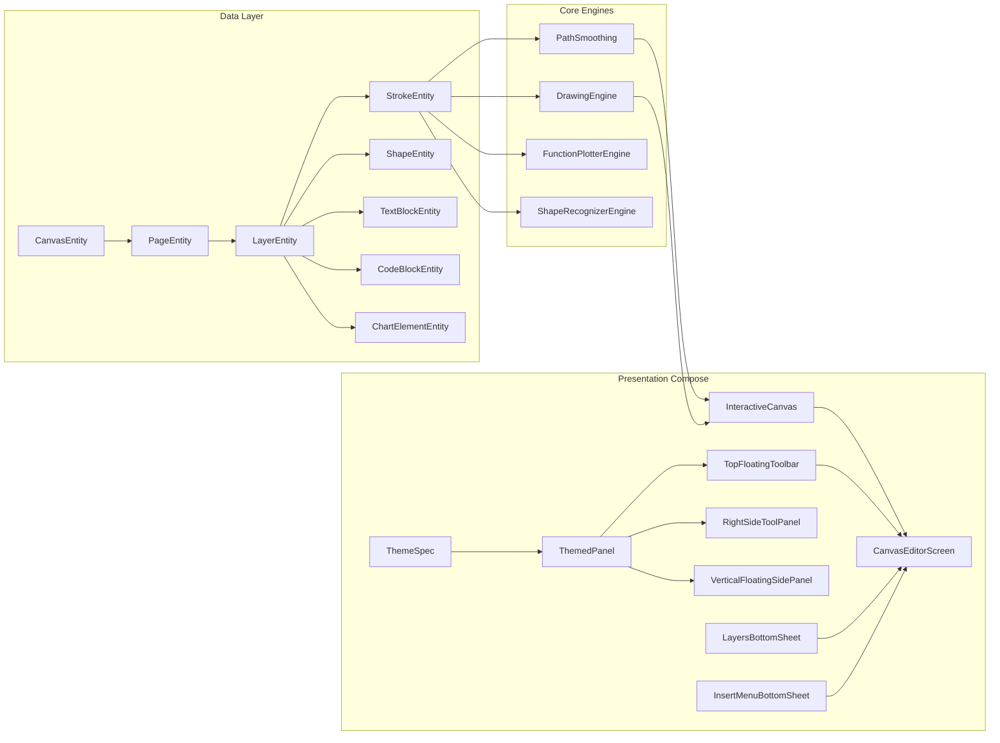

# 🗺️ ВІЗУАЛЬНА КАРТА ТА ІЄРАРХІЯ UI (VISUAL_MAP.md)
**Проєкт:** Sketchpad Windows 10/11 Desktop  
**Версія:** 2.0.0

---

## 1. СХЕМА РОЗТАШУВАННЯ UI НА ЕКРАНІ (Screen Layout & Overlay Layers)

```
┌────────────────────────────────────────────────────────────────────────────────────────┐
│ WINDOW TITLE BAR: Sketchpad Pro [Title] ──────────────────────────────── [—] [□] [✕] │
├────────────────────────────────────────────────────────────────────────────────────────┤
│ MAIN MENU BAR: File | Edit | View | Tools | Layers | Academic | AI | Help              │
├────────────────────────────────────────────────────────────────────────────────────────┤
│ TOP BAR: [Back] [Project Title] ── [SketchLink PC] [White Canvas] [Mic/Waveform]       │
│                                    [Audio List] [Layers] [Undo] [Redo] [Export] [More] │
├────────────────────────────────────────────────────────────────────────────────────────┤
│                                                                                        │
│                      ┌───────────────────────────────────────────┐                     │
│                      │ TOP FLOATING TOOLBAR:                     │                     │
│                      │ [Width Slider] [Preset 2|5|12]            │                     │
│                      │ [Pointer] [Pen] [Selector] [Eraser] [Fill]│                     │
│                      │ [Pipette] [Text] [Ruler] [Color] [Rotate] │                     │
│                      │ [Opacity Slider 5%..100%]                 │                     │
│                      └───────────────────────────────────────────┘                     │
│                                                                                        │
│ ┌───────────────┐                                                   ┌────────────────┐ │
│ │ VERTICAL SIDE │                                                   │ RIGHT SIDE     │ │
│ │ PANEL (LEFT)  │                                                   │ TOOL PANEL     │ │
│ │               │                                                   │ (COLLAPSIBLE): │ │
│ │ • Width Slider│                                                   │ • Live Preview │ │
│ │ • 2|5|12 px   │                                                   │ • Width + Pres │ │
│ │ • Live Swatch │                                                   │ • Opac + Pres  │ │
│ └───────────────┘                                                   │ • Color Swatch │ │
│                                                                     │ • Full Palette │ │
│                                                                     └────────────────┘ │
│                                                                                        │
│                         INTERACTIVE CANVAS (Infinite / Paged)                          │
│                         - Vector Strokes (Catmull-Rom Splines)                         │
│                         - Shapes, Text Blocks, Images, Charts                          │
│                         - Interactive Code Cards (Python/C/C++)                        │
│                         - Sticky Notes, Timers, Calculators                            │
│                         - Ruler / Protractor / Compass Overlay                         │
│                         - Lasso Selection Contour                                      │
│                                                                                        │
│                                                                                        │
│ ┌──────────────────────┐              ┌───────────────┐             ┌────────────────┐ │
│ │ BOTTOM LEFT OVERLAY: │              │ BOTTOM CENTER:│             │ BOTTOM RIGHT:  │ │
│ │ • 📄 Page X of N     │              │ • ➕ ДОДАТИ   │             │ • 🤖 AI FAB    │ │
│ │ • 🔍 Zoom Level %    │              │   (Insert)    │             │ • 🔗 Link Note │ │
│ └──────────────────────┘              └───────────────┘             └────────────────┘ │
└────────────────────────────────────────────────────────────────────────────────────────┘
```

---

## 2. ІЄРАРХІЯ МЕНЮ ТА ДІАЛОГІВ (Menu & Dialog Trigger Hierarchy)

```mermaid
graph TD
    A[Main Window / Top Bar] -->|Click MoreVert| B[CanvasTopMenuBottomSheet]
    A -->|Click Export| C[Export Dialog: PDF, PNG, SVG, Obsidian]
    A -->|Click Layers| D[LayersBottomSheet]
    A -->|Click Mic| E[Audio Recording HUD + Waveform]
    A -->|Click GraphicEq| F[AudioManagementSheet]
    A -->|Click Link| G[SketchLink PC Streaming Dialog]
    
    B -->|Page Background Color| B1[BackgroundColorPicker]
    B -->|Page Grid Pattern| B2[GridBackgroundSelector]
    B -->|Theme Settings| B3[ThemeSettingsScreen]
    
    H[TopFloatingToolbar] -->|Click Color Swatch| I[ColorPickerBottomSheet]
    H -->|Click Ruler Tool| J[Ruler / Protractor / Compass Overlay]
    H -->|Click Selector| K[Lasso Selection Overlay]
    
    L[Bottom 'Додати' Button] --> M[InsertMenuBottomSheet]
    M -->|Insert Image| M1[Image File Dialog]
    M -->|Insert Text| M2[TextInputDialog]
    M -->|Insert Shape| M3[Shape Selector]
    M -->|Insert Chart| M4[Chart / Math Function Plotter Dialog]
    M -->|Code Lab| M5[CodeLabDialog]
    M -->|Study Cards| M6[StudyDeckDialog]
    M -->|AI Summary / Quiz| M7[FloatingAiWindow]
    
    N[AI FAB Button] --> O{Has API Key?}
    O -->|Yes| M7
    O -->|No| P[AiProviderPickerSheet]
    P --> M7
    
    Q[Bottom Left Indicator] -->|Click Page Count| R[PageStripBottomSheet]
    Q -->|Click Zoom| S[Zoom Toggle: 100% -> 200% -> 300% -> Fit]
```



---

## 3. ПОТІК КОРИСТУВАЧА (User Flows)

### 3.1 Потік створення та малювання нотатки (Drawing Flow):
1. **Запуск додатку:**
   - Loading Screen з анімацією логотипу та ініціалізацією ресурсів/шрифтів.
   - Відновлення останньої відкритої нотатки з `AppData/Sketchpad/autosave/`.
2. **Вибір інструменту:**
   - Користувач обирає перо/олівець/маркер на `TopFloatingToolbar` або гарячою клавішею (`B`, `P`, `M`, `E`).
   - Налаштовує товщину або обирає швидкий пресет (`2`, `5`, `12` px).
   - Обирає колір з швидких свотчів або відкриває `ColorPickerBottomSheet`.
3. **Процес малювання:**
   - Введення стилусом (тиск/нахил через Windows Ink) або мишею.
   - Catmull-Rom згладжування формує плавний штрих.
   - Автосейв кожні 30 секунд у фоні без блокування UI.
4. **Використання академічних інструментів:**
   - Малювання приблизної фігури або графіка $\rightarrow$ кнопка `Vectorize` або `Plot Function` миттєво замінює штрихи на точну фігуру або 2D графік.
5. **Експорт:**
   - Натискання `Export` або `Ctrl+S` $\rightarrow$ вибір формату: PNG, SVG, PDF, Obsidian.
6. **Захист від закриття:**
   - При натисканні `✕` з незбереженими змінами $\rightarrow$ з'являється Confirmation Dialog: "Зберегти і закрити", "Закрити без збереження", "Скасувати".

---

## 4. ЗАЛЕЖНОСТІ МІЖ КОМПОНЕНТАМИ (Component Dependencies)



---
*Візуальна карта зафіксована для безпомилкової та точної побудови Windows версії.*
