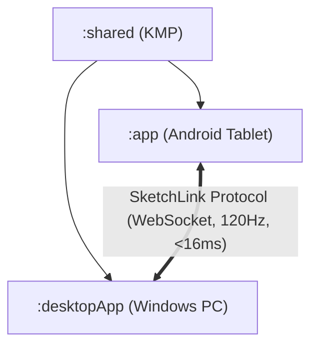

# Sketchpad Architecture & Technical Design Specification (v2.0.0)

## 1. System Overview

Sketchpad (MeCanvas) is a multiplatform academic and digital drawing application engineered for low-latency tablet sketch creation and high-performance desktop productivity. The system is split into three main modules:

- **`:shared` (Kotlin Multiplatform)**: Shared domain models, drawing math (Catmull-Rom splines, Ramer-Douglas-Peucker simplification), Command Pattern undo/redo engine, academic math/code engines, and SketchLink protocol & network layer (Ktor WebSocket client & server).
- **`:app` (Android Tablet)**: Jetpack Compose UI, tablet-optimized toolbar, stylus pressure/tilt handling, White Canvas mode, Room database, Firebase AI assistant, and SketchLink streaming client.
- **`:desktopApp` (Windows PC)**: Compose Multiplatform Desktop, Skiko-accelerated canvas, Windows Ink API integration, Desktop hotkey engine, 10 dynamic themes, multi-format export engine (SVG, PDF, PNG, ICO, ZIP bundles), and embedded SketchLink server (port 8765).

---

## 2. Shared Module Architecture (`:shared`)

### 2.1 Domain Models
The domain model layer in `:shared` encapsulates all canvas entities using Kotlinx Serialization:
- `CanvasEntity`: Container for a multi-page document with UUID, title, timestamp, and page list.
- `PageEntity`: Represents an individual canvas page with background grid settings, symmetry configuration, and layer hierarchy (`layers: List<LayerEntity>`). Provides backward-compatibility methods (`getEffectiveLayers()`) for legacy single-layer structures.
- `LayerEntity`: Discrete drawing layer with `id`, `name`, `isVisible`, `isLocked`, `opacity`, `blendMode`, and element lists (`strokes`, `shapes`, `textBlocks`, `images`).
- `StrokeEntity` & `StrokePoint`: Low-level stroke representation capturing coordinates `(x, y)`, `pressure` (0.0..1.0), `tilt`, `azimuth`, and `timestampMs`.
- `HslaColor`: High-precision color model with direct conversion to ARGB and hex string formats.

### 2.2 Drawing Mathematics & Algorithms
- **Catmull-Rom Spline Smoothing**: Calculates smooth cubic Hermite interpolations with centripetal parameterization ($\alpha = 0.5$) to prevent cusps and loops during high-speed stylus strokes.
- **Ramer-Douglas-Peucker (RDP) Polyline Simplification**: Reduces raw stylus point density by up to 60-80% without perceptual fidelity loss using perpendicular distance thresholding.
- **Swept-Circle Eraser Geometry**: Point-to-segment distance calculations determine stroke intersections with variable eraser radii.
- **Symmetric Reflection Math**: `generateSymmetricStrokes()` generates reflected copies of active strokes across Horizontal, Vertical, and Quad axes centered at canvas midpoint $(W/2, H/2)$.

### 2.3 Undo / Redo Command Pattern
- Implements `CanvasCommand` with `execute(page): PageEntity` and `undo(page): PageEntity`.
- Concrete commands: `AddStrokeCommand`, `RemoveStrokeCommand`, `AddShapeCommand`, `ClearPageCommand`, `AddLayerCommand`, `ReorderLayersCommand`, `DeleteLayerCommand`.
- Stack depth capped at 50 levels to bound memory utilization on mobile hardware.

---

## 3. Desktop Application Architecture (`:desktopApp`)

### 3.1 Skiko & Compose Desktop Rendering Pipeline
The desktop canvas rendering engine leverages Jetpack Compose Multiplatform with Skiko (Skia for Kotlin):
1. **Background Layer**: Renders pattern grid (Dots, Graph, Isometric, Lines) with adaptive step size and theme colors.
2. **Reference Image**: Optional translucent overlay/underlay with adjustable opacity and position.
3. **Layer Stack Composite**: Iterates over visible layers from bottom to top, applying layer alpha and Porter-Duff blend modes (`Normal`, `Multiply`, `Screen`, `Overlay`).
4. **Active Stroke Preview**: Real-time rendering of in-progress stroke path with Catmull-Rom spline curves.
5. **Symmetry Guides & Overlays**: Quad, horizontal, or vertical reference lines with visual center indicators.

### 3.2 Desktop Hotkeys & Input Architecture
The hotkey management subsystem (`DesktopShortcutManager`) binds standard desktop accelerators:
- `Ctrl + Z` / `Ctrl + Y`: Undo / Redo
- `Ctrl + S`: Save / Export Project
- `Ctrl + N`: New Canvas Page
- `Ctrl + Shift + S`: Quick SVG Export
- `Ctrl + Shift + P`: Quick PDF Export
- `B`, `E`, `P`, `M`, `S`, `R`: Quick tool switches (Brush, Eraser, Pen, Math, Select, Ruler)
- `[` / `]`: Decrease / Increase brush size
- `1` .. `9`: Instant swatch color selection
- `F11`: Fullscreen toggle
- `Space + Drag`: Pan viewport

### 3.3 Export Subsystem
- **SVG Vector Export**: Serializes vector strokes with cubic Bézier curves `<path d="M... C..."/>` preserving exact vector fidelity at any zoom level.
- **PDF Document Generation**: Uses OpenPDF / iText to generate multi-page, print-ready vector PDF documents with margins and metadata.
- **High-Resolution Rasterization**: Renders Skia bitmap to PNG / JPEG with custom DPI scaling (1x to 4x).
- **Project Bundles (`.sketchpad`)**: ZIP container holding JSON document tree (`canvas.json`) and raw asset attachments.

---

## 4. Android Tablet Architecture (`:app`)

### 4.1 White Canvas Mode
- **Zero-Distraction UI**: Smoothly animates and hides top navigation bars, tool docks, side panels, and system bars (`WindowInsetsControllerCompat`).
- **Floating Minimal HUD**: Translucent, draggable floating button allows instant one-tap exit back to full toolbar controls.
- **Streaming Mode**: In White Canvas Mode, tablet acts as an ultra-responsive digitizer pad for the PC desktop canvas.

### 4.2 Stylus Hardware Acceleration
- Captures historical batch motion events via Android `MotionEvent` historical coordinates for sub-millisecond precision.
- Pressure normalization using device-specific calibration curves.
- Palm rejection filtering ignoring touches with large contact area or low major-axis eccentricity.

---

## 5. Security & Network Reliability

- **PIN Authentication**: SketchLink WebSocket server enforces a 4-digit PIN exchange during handshake. Unauthenticated packets are immediately rejected.
- **Local Network Isolation**: Server binds to local LAN interfaces or loopback for USB ADB port forwarding (`adb forward tcp:8765 tcp:8765`).
- **Offline Resilient Buffer**: When WiFi connection drops, tablet client buffers up to 4000 stroke packets (~30 seconds of continuous drawing) and flushes them in order upon reconnection without data loss.
