# 🚀 ARCHITECTURE & MIGRATION GUIDE: Sketchpad Windows Desktop

## 1. Overview & Architecture

Sketchpad Desktop is built on **Compose Multiplatform for Desktop (JVM 21)** and shares core mathematical models, drawing primitives, and business logic with the Android edition via the `:shared` Kotlin Multiplatform module.

```mermaid
graph TD
    DesktopMain[Main.kt / Window & Native MenuBar] --> Loading[LoadingScreen.kt]
    DesktopMain --> MasterScreen[DesktopCanvasEditorScreen.kt]
    
    subgraph UI Components
        MasterScreen --> CanvasView[DesktopCanvasView.kt]
        MasterScreen --> TopBar[DesktopTopFloatingToolbar.kt]
        MasterScreen --> SidePanels[DesktopVerticalSidePanel.kt]
        MasterScreen --> RightPanel[DesktopRightSideToolPanel.kt]
        MasterScreen --> Overlays[DesktopOverlays.kt / HUD]
        MasterScreen --> Rulers[DesktopRulerOverlays.kt]
    end
    
    subgraph Modals & Windows
        MasterScreen --> ColorPicker[DesktopColorPickerModal.kt]
        MasterScreen --> InsertModal[DesktopInsertMenuModal.kt]
        MasterScreen --> LayersModal[DesktopLayersModal.kt]
        MasterScreen --> TopMenuModal[DesktopCanvasTopMenuModal.kt]
        MasterScreen --> AiWindow[DesktopAiWindow.kt]
        MasterScreen --> CodeLab[DesktopStudyDialogs.kt / CodeLab]
        MasterScreen --> StudyCards[DesktopStudyDialogs.kt / StudyDeck]
        MasterScreen --> PageStrip[DesktopPageAndTimelineModals.kt]
    end
    
    subgraph Core Services & Data Layer
        MasterScreen --> VM[DesktopViewModel.kt]
        VM --> Autosave[DesktopAutosaveManager.kt]
        VM --> Audio[DesktopAudioRecorderManager.kt]
        VM --> AI[DesktopAiService.kt]
        VM --> Export[DesktopExportManager.kt]
        VM --> Shared[:shared KMP Engine]
    end
```



---

## 2. Key Components Parity & Adaptations

### 2.1 Neumorphic & Theme System
- **Android:** Custom canvas shadow drawing.
- **Desktop:** `NeumorphicModifier.kt` and `ThemedPanel.kt` utilizing Compose Desktop native drop shadows and highlights for all 10 theme styles (Default, Forest, Sunset, Cyberpunk, Lavender, Sepia, Monochrome, Slate, Deep Blue, Crimson).

### 2.2 Stylus & Windows Ink Support
- **Windows Ink Integration:** `WindowsInkHandler.kt` extracts normalized pressure (0.0 to 1.0), tilt, and azimuth from Windows tablet styluses (Surface Pen, Wacom, Huion) with smooth Catmull-Rom interpolation.

### 2.3 Audio & Live Synchronization
- **Desktop Engine:** `DesktopAudioRecorderManager.kt` utilizes standard `javax.sound.sampled` with 44.1kHz 16-bit PCM WAV recording, live RMS amplitude visualizer stream, and real-time audio clip playback with stroke sync markers.

### 2.4 Multimodal AI Architecture
- **Multi-Provider Hub:** `DesktopAiService.kt` supports Gemini 2.5 Flash, OpenAI GPT-4o, Anthropic Claude 3.5 Sonnet, DeepSeek Chat, and Local LLM (Ollama/Custom endpoint), featuring image vision encoding and API key persistence in `%APPDATA%/Sketchpad/ai_config.json`.

### 2.5 Autosave & Crash Protection
- **30-Second Background Loop:** Atomic writes to `%APPDATA%/Sketchpad/autosave/current_session.sketchpad` with `.tmp` staging and `.bak` fallback.
- **Unsaved Changes Confirmation Dialog:** Prompts "Save & Exit", "Exit without Saving", or "Cancel" when closing window or pressing Alt+F4.

---

## 3. How to Run & Package

### Run locally in development mode:
```powershell
.\gradlew.bat :desktopApp:run
```

### Build self-contained UberJar:
```powershell
.\gradlew.bat :desktopApp:packageUberJarForCurrentOS
```
Output location: `desktopApp/build/compose/jars/Sketchpad-windows-x64-2.0.0.jar`

### Package native Windows installer (.msi / .exe):
```powershell
.\gradlew.bat :desktopApp:packageDistributionForCurrentOS
```
Output location: `desktopApp/build/compose/binaries/main/msi/`
