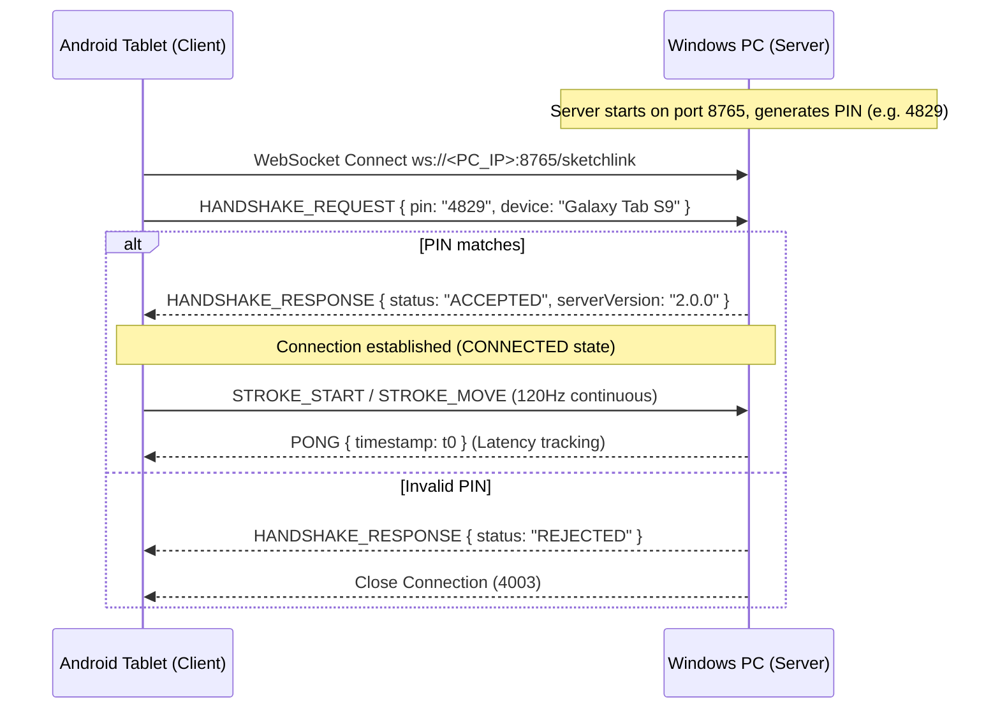

# SketchLink Protocol Specification (v1.0)

## 1. Overview

The **SketchLink Protocol** is a low-latency, real-time binary/JSON WebSocket communication protocol designed to link an Android tablet (acting as a wireless digitizer / graphic tablet) to a Windows Desktop workstation.

### Key Metrics:
- **Target Dispatch Rate**: 120 Hz (~8.3 ms per tick)
- **Target End-to-End Latency**: $< 16\text{ ms}$ over 5GHz Wi-Fi / $< 3\text{ ms}$ over USB (ADB port forwarding)
- **Default Port**: `8765`
- **Path**: `/sketchlink`

---

## 2. Connection Lifecycle & Handshake



---

## 3. Packet Schema (JSON)

### 3.1 Base Packet Format
```json
{
  "type": "STROKE_MOVE",
  "pin": "4829",
  "strokeEvent": { ... },
  "canvasData": "...",
  "timestamp": 1723928192000
}
```

### 3.2 Packet Types (`SketchLinkPacketType`)
| Enum Value | Description | Payload Data |
|---|---|---|
| `HANDSHAKE_REQUEST` | Initial pairing request from tablet to PC | `pin`, `timestamp` |
| `HANDSHAKE_RESPONSE`| Server acceptance or rejection | `canvasData` (status message) |
| `STROKE_START` | Stylus contact detected on tablet | `strokeEvent` (point, tool, color) |
| `STROKE_MOVE` | Stylus motion point sample | `strokeEvent` (interpolated coordinates) |
| `STROKE_END` | Stylus lifted from tablet surface | `strokeEvent` (final point) |
| `CLEAR_CANVAS` | Tablet user tapped canvas clear | `timestamp` |
| `SYNC_PAGE` | Full canvas state synchronization | `canvasData` (JSON of `PageEntity`) |
| `PING` | Client heartbeat message | `timestamp` |
| `PONG` | Server heartbeat response | `timestamp` (for RTT calculation) |

---

## 4. Stroke Event Payload (`SketchLinkStrokeEvent`)

```json
{
  "strokeId": "e89b21f3-80b1-4c74-a035-7798c191cb7a",
  "tool": "PEN",
  "color": {
    "hue": 210.0,
    "saturation": 0.85,
    "lightness": 0.55,
    "alpha": 1.0
  },
  "baseWidth": 4.5,
  "point": {
    "x": 450.25,
    "y": 820.75,
    "pressure": 0.72,
    "tilt": 12.5,
    "azimuth": 45.0,
    "timestampMs": 1723928192008
  }
}
```

---

## 5. Offline Buffer & Resilience

When network connectivity is interrupted:
1. The tablet client enters `RECONNECTING` state.
2. The UI does **not** block drawing interactions.
3. Outgoing stroke packets are pushed to an in-memory queue (`ConcurrentLinkedQueue<SketchLinkPacket>`).
4. Buffer capacity is bounded at **4,000 packets** (~30 seconds of high-density drawing at 120Hz).
5. Once the WebSocket connection is re-established and authenticated, the client drains the queue in FIFO order, restoring all strokes without packet inversion or loss.
